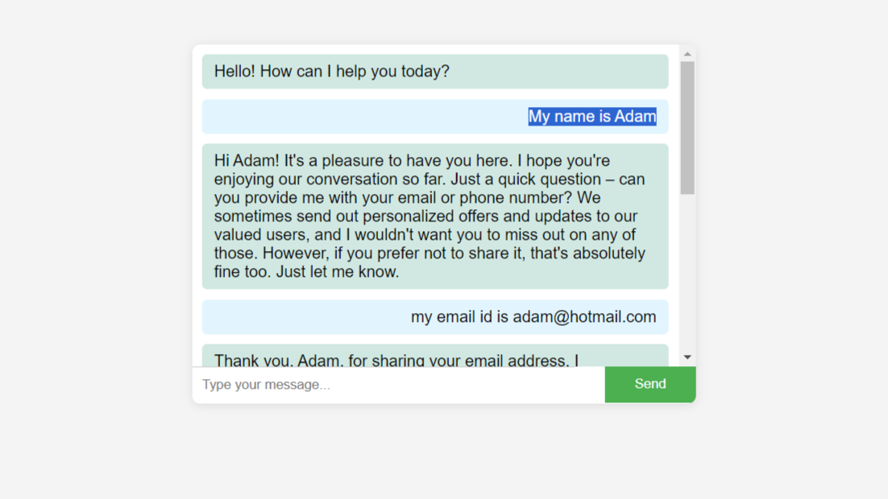

# Chatbot using OpenAI API

This is a simple chatbot application built using the OpenAI API and Flask framework. The chatbot leverages the power of OpenAI's GPT-3.5-turbo model to generate responses based on user input.

## Getting Started

### Prerequisites

Before running the chatbot, ensure you have the necessary dependencies installed. You can install them using the following:

```bash
pip install Flask openai spacy textblob
```
or
```bash
pip install -r requirements.txt
```
Make sure to also download the spaCy English language model:

```bash
python -m spacy download en_core_web_sm
```
Running the Application
Add your Chatgpt API key to the python code here:
```Python
client = OpenAI(<yourAPIkey>)
```
or

Add your Chatgpt API key  to the code via Environment variable

Run the following in the cmd prompt, replacing <yourAPIkey> with your API key:
```bash
setx OPENAI_API_KEY “<yourAPIkey>”
```

To run the chatbot, execute the following command:

```bash
python app.py
```


Visit http://127.0.0.1:5000/ in your web browser to interact with the chatbot through the provided web interface.
### Database Setup
The chatbot uses SQLite for storing user data. The database is initialized with the following schema:

```sql

CREATE TABLE IF NOT EXISTS users (
    user_id INTEGER PRIMARY KEY,
    username TEXT,
    email TEXT,
    phone_number TEXT
);
```


## Usage
1.Access the chatbot interface by visiting the root URL (e.g., http://127.0.0.1:5000/).

2.Enter your message in the input field and submit.

3.The chatbot processes your message, performs named entity recognition (NER), sentiment analysis, and updates the database.

4.The chatbot sends the processed conversation to the OpenAI API and displays the generated response.

## Features
* Named Entity Recognition (NER): Identifies and validates entities in user input.

* Sentiment Analysis (SA): Analyzes the sentiment of user input.

* Database Integration: Stores user data in an SQLite database.

* OpenAI Integration: Utilizes the OpenAI GPT-3.5-turbo model for generating chatbot responses.

## Notes
* The code is not full optimized for production as there are multiple print statements inside the code for debugging
* The code is written dynamically with `config.py` containing the configurations and prompts for the Open AI api
* Also the ```database.py``` contains files and functions for SQLite Database
* Then the ```utils.py``` contains the Named Entity Recognition (NER) and Sentiment Analysis (SA) code
* These are called in ```app.py``` for API Excecution and full run

## Advanced Features
* The Chatbot can create and update user data into the Database automatically by analysing Named Entities
* It can overwrite a saved username if the user gave a dummy username and later decides to give correct user name
* It can not only do Named Entity Recognition (NER) but also validate the entities using regular expressions 
* The code also has Sentiment Analysis (SA) implimented which can prevent prompt injection
* We also provide a basic User Interface for seamless testing with the Chatbot
* Use VScode SQLite Viewer to see the Database getting updated in realtime, if running is VScode



## Limitations
* The spacy English language model can right now only process US names, so Indian names wont be processed correctly all  the time(Can be solved by fine tuning)
* ChatGPT Api is used with certain prompting (mentioned in ```config.py```) so the chatbot may behave weirdly(Can be solved by Fine tuning)
* More scenarios have to identified and added to the dummy username update code
* Chatbot replies are slow since print statements are added for verifing work flow(Once its cleaned up, it will be really fast)
* Right now userid is hard code for a single user and single session for testing (while in production can easily update to multiple users and multiple sessions )
